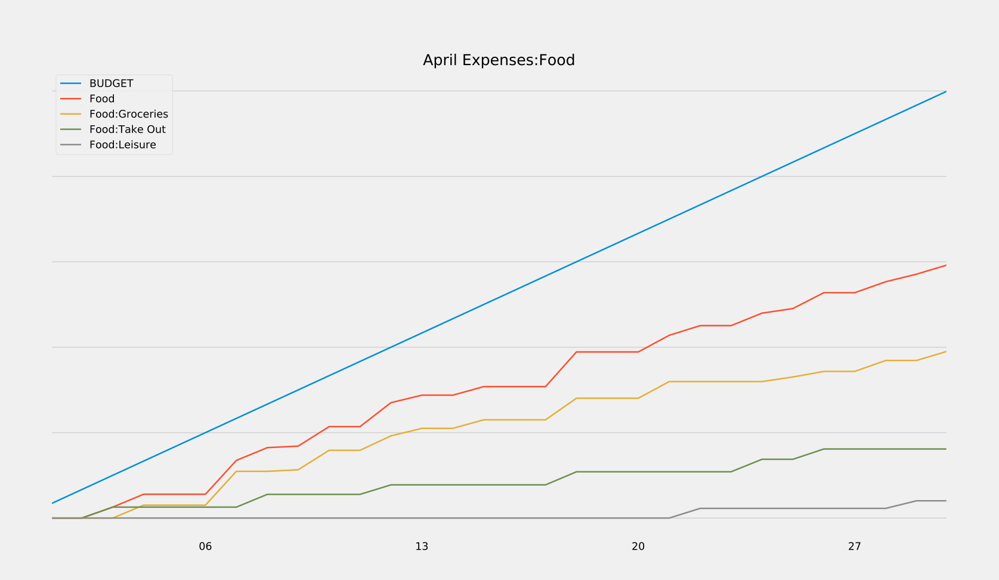

This script generates a simple budget report for GnuCash accounts. The reports can be configured to use different accounts and will look like this:



# Description
This script queries a SQLite GnuCash file for a given list of accounts, then plots them in a cumulative manner (so the plot line for Expenses will be its balance plus the sum of all of its child balances, Expenses:Food will be the sum of *its* balance plus child account balances, etc.)

In addition, this script plots a line on each report that shows a target "budget" value. Please note that the concept of a budget as used in this script is quite different from that used by GnuCash. In this script's case, each account has a single floating point budget, representing the target balance of that account each month.

This script will plot a year-to-date graph for each account for each year >= 2020, as well as separate graphs for each month of each plotted year, up to the current month. These can be dumped to a configurable `--output` directory, which defaults to the script directory.

# Setup
I have only tested this on python 3.8.1, so be warned. I believe it requires python 3.x or newer, but I could be wrong.

1. Make sure that your GnuCash file is saved in SQLite format.
2. Run `pip install -r requirements.txt`. I recommend using a virtualenv or similar.

# Running
To run the command, provide it with a path to your gnucash file, the accounts you want to use, and the budgets for each account. Use `python3 budget.py --help` for more info on the desired format. Here's a sample command:

```
python budget.py ../gnucash/main.gnucash \
    --ignored_accounts="Expenses:Taxes,Expenses:401k Management,Expenses:Rent" \
    --accounts="Expenses,Expenses:Food,Expenses:Leisure" \
    --budgets="0,0,0"
```

If you are using a version of GnuCash >3.7, you may need to use the `--unsupported_table_hotfix` flag to get this to run (until piecash pushes a release that fixes that bug)
